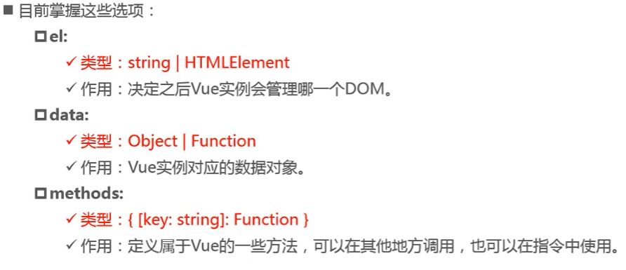
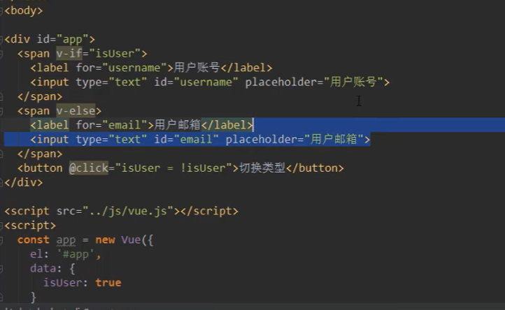
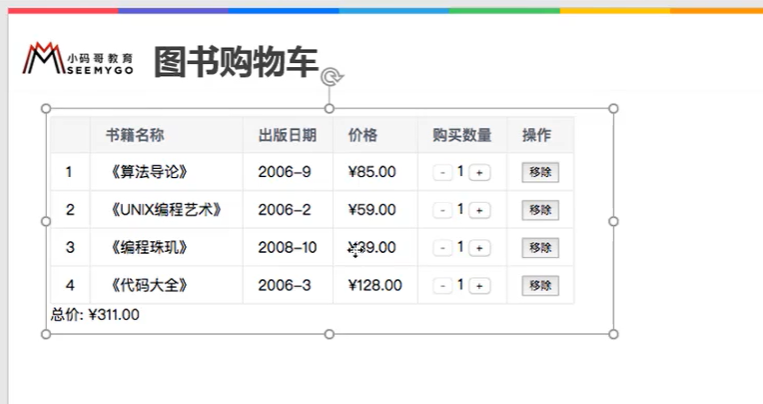
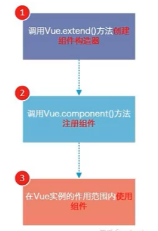
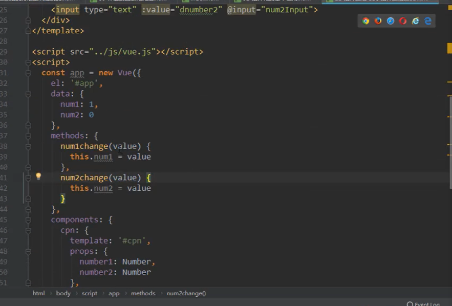
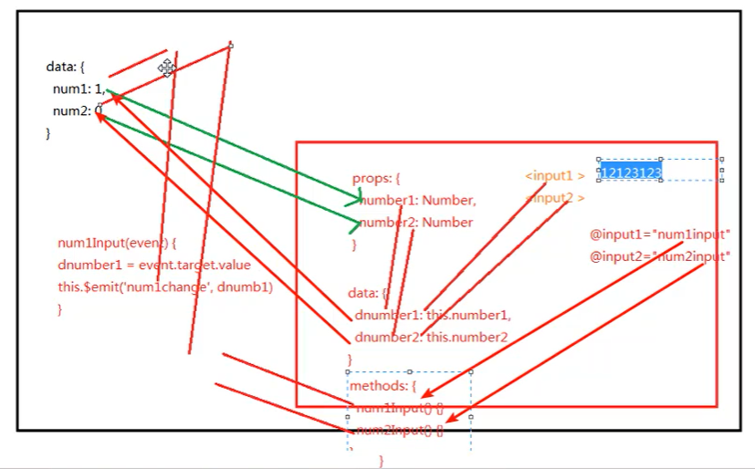
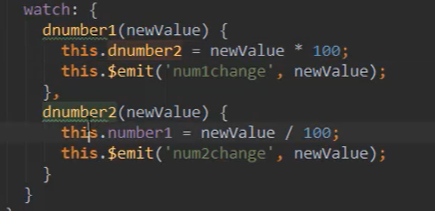
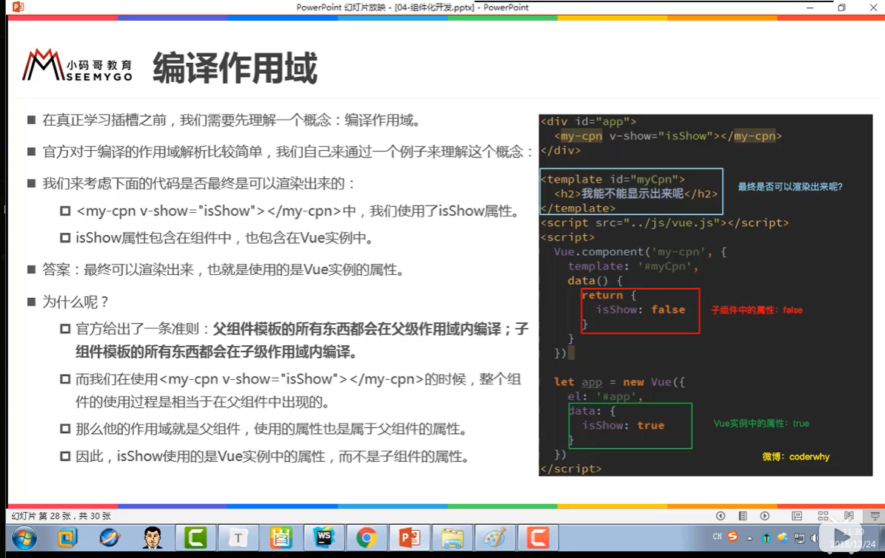
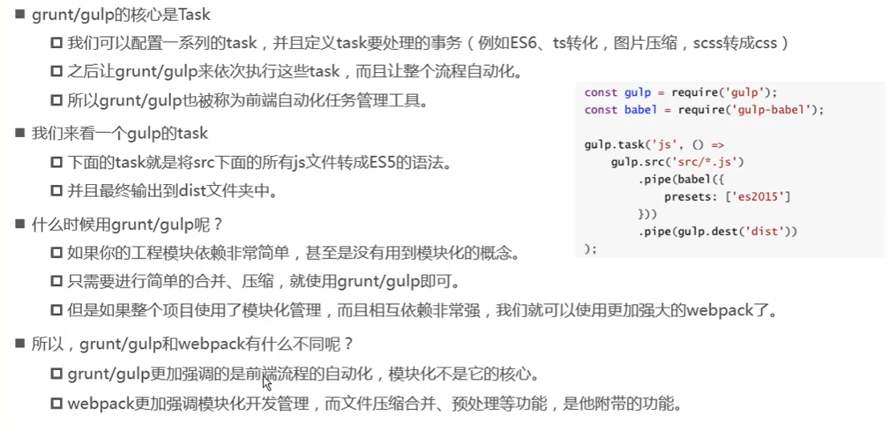

# vue

## ES6语法

#### let/var/const

es5只有函数有作用域 会覆盖

es6中加入的let有for 以及 if作用域

## 学习网站：

vue所有基础语法：https://blog.csdn.net/weixin_43342105/article/details/106153672
vuex核心内容及重点细节总结：https://blog.csdn.net/weixin_43342105/article/details/105703491
vue cli2 ，3详解：https://blog.csdn.net/weixin_43342105/article/details/106248521
vue router全面详细知识点：https://blog.csdn.net/weixin_43342105/article/details/106248594
axios框架核心知识：https://blog.csdn.net/weixin_43342105/article/details/105740102

博客 http://www.iocoder.cn/?bilibili&BV1rE411x7vd

https://blog.csdn.net/qq_44317018/article/details/104146747


## vue初识

元素js做法（编程范式：声明式编程）

1.创建div元素设置id属性

2定义一个变量message 

```javascript
const vue01 = new Vue({
    el:'#app',  //挂载要管理的元素
    data:{
        essage:'hello',
        name:'code'
    }
})
```

3讲message变量放在div中显示

## 创建vue实例



#### 方法与函数区别：

与实例对象挂钩的叫方法

## Vue生命周期

### 生命周期函数

#### create: funtion(){}

#### mounted: funtion(){}

## Vue基本语法

```javascript
const vuedome = new Vue({
    el:'#app',
    data:{
        firstname:'Kobe',
        liastname;'Bryant',
        message:'hello'
        imgURL:'图片地址'
        active:'active'
    }
})
```

#### 插值操作 mustache语法

1.{{message}}

2.{{ firstname  +‘   ’+ lastname }}

3.{{message1}} {{message2}}

mustache语法中可以使用简单表达式（空格显示+‘ ’+）

#### v-once指令使用

```javascript
<h2 v-once> {{message}} </h2>	
//不需要随message改变
```

#### v-html指令使用

```javascript
url:'<a href="www.baidu.com">百度</a>'

<h2 v-html="url"> </h2>
```

#### v-text指令使用

```javascript
<h2 v-text="message"> </h2>
```

直接覆盖标签内全部内容

#### v-pre指令使用

```javascript
<h2 v-pre>{{message}} </h2>
```

取消转义 不进行解析

#### v-cloak指令使用

在vue解析前有v-cloak属性，解析后没有

```javascript
<div id='app' v-cloak > </div>
<style> 
    [v-cloak] {
        display: none;
    }
</style>
```

### <u>v-bind指令使用</u>

属性来动态绑定，例如a元素中href.img中src

```javascript
//1.绑定基本属性
 
//2.动态绑定class 对象语法
    
<h2 :class='active'>{{message}}</h2>
<h2 :class="{类名1：boolean,类名2：true}">{{message}}</h2>
//3.动态绑定style
data:{
    finalSize:100;
    finalColor:'red'
}
<h2 :style="{fontSize：finalSize +’px‘,color：finalColor}">{{message}}</h2>
```

#### 计算属性

计算属性只调用一次

##### 基本使用

```javascript
<h2>{{fullName}}</h2>
computed:{ //计算属性
	fullName:function(){
        return this.firstName +' '+ this.lastName
    }
}
```

##### 复杂操作

```javascript
data:{
    books:[
        {id:1,name:'01',price:11},
        {id:2,name:'03',price:13},
        {id:3,name:'05',price:15}
    ]
},
computed:{
    totalPrice:function(){
        let result = 0
       	for(let i=0;i<=this.books.lenght;i++){
            result+=this.books[i].price
        }
        return result
    }
}
//es6中循环方法 for(let in this.books){}
//			  for(let book of this.books){}
<h2>{{fullname}}</h2>
computed:{
    fullname:{
        get:function(){
            return this.firstName +' '+ this.lastName
        }
       //简洁写法
     fullname:function(){
            return this.firstName +' '+ this.lastName
        }
    }
}
```

#### 计算属性缓存

1.直接拼接：语法过于繁琐

2.通过定义methods：多次执行时会调用多次

3.通过计算属性computed：多次执行时会调用一次(内部会进行缓存)

### v-on指令使用

事件监听时且不用传参

```javascript
<button v-on:click="add" > +
<button @click="add" > +
methods{
	add(){
	this.counter++
	}
}
```

#### v-on参数

调用方式时，如何手动获取到浏览器参数的event对象：$event

```javascript
button @click='btn1Click('abc',$event)'
button @click='btn1Click(123,$event)'
```

#### v-on修饰符

1.阻止事件冒泡 .stop:

```
button @click.stop='btn1Click(123,$event)'
```

2.阻止默认事件

```
有表达式：button @click.prevent='btn1Click(123,$event)'

无表达式：form @submit.prevent
```

3.事件从特定键触发时才会触发回调

```
.{keyCode | keyAlias }

<input type= 'text' @keyup = "keyUp">
<input type= 'text' @keyup.enter = "keyUp">
```

点击回调只触发一次

```
button @click.once='btn1Click(123,$event)'
```

串联修饰符,

键修饰符，键别名

 键修饰符，键代码.

### 条件判断v-if,v-else，v-else-if

```javascript
//v-if
data{
    score:99
    ifshow:'true', 
}    
<h2 v-if = ifshow>
  
//v-if与v-else
<h2 v-if = ifshow>{{message}}</h2>
<h2 v-else>如果isshow为false 显示</h2>

//v-else-if
<h2 v-if="score>=90">优秀</h2>
<h2 v-else-if="score>=80">良好</h2>
<h2 v-else-if="score>=60">及格</h2>
<h2 v-else>不及格</h2>
```

##### 案例1 用户登录切换案例



案例中问题：input复用

解决：在input中加一个key，key值不相同则不复用

#### v-if与v-show区别

```javascript
<h2 v-if = ifshow>{{message}}</h2>
//v-if为false时，包含v-if指令的元素不存在dom中 删掉/取回
<h2 v-show = ifshow>{{message}}</h2>
//v-show 为false时只是增加了一个行内样式 display:none
```

切换频率很高时使用v-show  只有一次切换时使用v-if

##### 案例2 点击变色

p39

##### 案例3 图书购物车

#####  p40



#### 过滤器

与data,methods同级

```javascript
filters：{
	showPrice(price){
	return '￥' + prince.toFixed(2)
	}
}

<td>{{item.price | showPrice }}</td>
//价格显示

for循环其他写法
1.for(let i in this.books){
    //i就是索引值
}
2.for (let item of this.books){
    let totalPrice = 0;
    totalPrice +=item.price*item.count
}
3.函数时编程

```

#### 高阶函数

```javascript
//1. filter函数使用
const nums = [10,20,40,60,100,150,189,200]
let newNums = nums.filter(function(n){
    return n<100
})
//2.map函数使用

let new2Nums = newNums.map(function(n){
    return n*2
})
//3.reduce函数使用
//对数组中所有内容进行汇总
//new2Nums=[10,20,30,40]
let total = new2Nums.reduce(function(preValue,n){
    return preValue+n
},0)
//第一次 preValue 0 n 20,
// 0 + 10-》10+20-》30+30-》60+40 
```

### v-model

#### 基本使用

```javascript
//实现双向绑定
<input type =''text v-model = "message">
```

#### input中input事件

v-on：input=‘keyClick’

#### v-mode：radio使用

```javascript
<label for = 'male'>
    <input tupe = 'radio' id = 'male' name = 'sex' v-moel='sex'>男
</label>
<label for = 'female'>
    <input tupe = 'radio' id = 'female' name = 'sex' v-moel='sex'>女
</label>
<h2>{{sex}}</h2>
//没有v-model必须有name='sex'
<script>
	data：{
        sex:''
    }        
</script>
```

#### v-mode：checkbox使用

```javascript
//单选框
<label for = 'agree'>
    <input tupe = "checkbox" id = 'agree' n v-moel="isAgree">同意协议
</label>
<h2>{{isAgree}}</h2>
<button :disabled="!isAgress"></button>
<script>
	data：{
        isAgree:false
    }        
</script>
//多选框
    <input tupe = "checkbox" value = '篮球' n v-moel="isAgree">篮球
	<input tupe = "checkbox" value = '足球' n v-moel="isAgree">足球
	<input tupe = "checkbox" value = '兵乓球' n v-moel="isAgree">兵乓球
	<input tupe = "checkbox" value = '羽毛球' n v-moel="isAgree">羽毛球
<h2>{{isAgree}}</h2>
data：{
        isAgree:[]  //多选框
    }  
```

#### v-mode：select使用

```javascript
//单选
<select name = "abc" id="" v-mode="fruit">
    <option value="苹果" > 苹果 </option>
    <option value="香蕉" > 香蕉</option>
    <option value="榴莲" > 榴莲 </option>
    <option value="葡萄" > 葡萄 </option>
</select>
<h2>选择水果是：{{fruit}}</h2>
data：{
        fruit:香蕉  //多选框
        hobbies:[]
        originHobbies:['cs','lol','dota','r6']
    }  

//选择多个
<select name = "abc" id="" v-mode="fruit" multiple>
//
<labe v-for = "item in originHobbies" :for = "item">
	<input type = "checkbox" :value = "item" :id = "item" v-mode = "hobbies">   {{item}} 
</label>

data：{
        fruit:香蕉  //多选框
        hobbies:[]
        originHobbies:['cs','lol','dota','r6']
    }  
```

#### v-mode修饰符

```javascript
// lazy 失去焦点 回车后
<input type ="text" v-mode.lazy="message">
<h2> {{message}}</h2>
    data:{
        message:''
    }

// number  v-model默认都是字符型
<input type ="number" v-mode.number="message">
//trim修饰符  过滤左右两边得空格
<input type ="number" v-mode.trim="message">
```

### 组件化开发-VUE组件化开发

#### 注册组件



#### 基本使用

```javascript
<div id = "app">
    <my-cpn></my-cpn>
</div>
<script>
  	//1创建组件构造器对象
    const cpnC= Vue.extend({
        template:`
		<div>
			<h2>我是标题</h2>
			<p>我是内容</p>
		</div>`
    })
	//局部组件 在单个实例下
		components:{
            //可以注册多个
            cpn:cpnC
        }
	//注册组件（全局组件，多个vue实例下使用）
	Vue.component('my-cpn',cpnC)
    const app = new Vue({
      el:'app',
      data:{
          message:'hello'
          
      }
        //局部组件
        components:{
            //可以注册多个
            cpn:cpnC
        }
  })  
    
    
//es6新语法  ··定义字符串 可以换行
</script>    
```

#### 全局组件与局部组件

组件必须放在vue实例中

局部组件 在单个实例下

全局组件，多个vue实例下使用

Vue.component('my-cpn',cpnC)

#### 父组件与子组件

```javascript
//子组件1
const cpnC1 = Vue.extend({
    templage:`
	<div>
		<h2>标题1</h2>
	</div>
`
})

//创建第二个组件构造器（父组件）
const cpnC2 = Vue.extend({
    templage:`
	<div>
		<h2>标题2</h2>
		<cpn1></cpn1>
	</div>
`,
    components:{
        cpn1:cpnC1
    }
})
//root组件（vue实例可以看成根组件）

const app = new Vue({
      el:'app',
      data:{  
          message:'hello'
      }
    components:{
     cpn2:cpC2
}
  })  
```

#### 注册组件语法糖

```javascript
//方法一
Vue.component('cpn1',{
    template:`
	<div>
		<h2></h2>
	</div>
`
})
//方法二
<template>
    
</template>
//全局组件

//局部注册 
在vue实例中
data:{},
components{
    'cpn2':{
        template:`
	<div>
		<h2>biaoti2</h2>
	</div>
`
    }
}
```

#### 组件抽离写法

```javascript
//1.script标签
<script type="text/x-template" id="cpn1">
	<div>
    	<h2>hello</h2>
    </div>        
</script>
Vue.component('cpn',{
    template:'#cpn1'
})


//2.template
<template id="cpn2">
    <div>
    	<h2>hello</h2>
    </div> 
</template>

Vue.component('cpn',{
    template:'#cpn2'
})
```

#### 组件中数据存放问题

组件中可以有data属性也可以有methods属性

data属性必须是一个函数而且函数返回一个对象，对象内部保存着数据

```javascript
//组件自己数据存放
//注册一个全局属性
<template id="cpn">
    <div>
    	<h2>{{tittle}}</h2>
    </div> 
</template>
Vue.component('cpn',{
	template:'#cpn',
    data(){
    //不能是一个对象属性
    return {
        title:'abc',
        counter:0
    },
    methods{
        increment(){
            this.counter++
        }
    }
}
})
```

### 父子组件通信

#### 父组件传子组件

```javascript
<div>
<cpn v-bind:cmovies="movies" :cmessage="message"></cpn>    
</div>
//子组件1
<template id ='cpn'>
    <div>
    	<p>{{cmessage}}</p>
		<h2>{{cmovies}}</h2>
    </div>
</template>

//父传子
const cpn = {
    templage:'#cpn',
    props:['cmovies'.'cmessage'],
//1.类型限制props:{ cmovies:Array}
//2.提供一些默认值  类型是对象或者数组时默认值必须是一个函数
// cmessage:{
    type:String,
    default:'aaaaaaa',
    required:true    //required代表必须传值
//}
	data(){
        return{}
    },
    methods:{
        
    }
}
//root组件（vue实例可以看成根组件）

const app = new Vue({
      el:'#app',
      data:{  
          message:'hello',
          movies:['柯南','死神','火影忍者','海贼王']
      }
    components:{
     cpn
}
  })  

```

#### props中驼峰标识

```javascript
<div id = "app">
    <cpn :cinfo="info"></cpn>
</div>
<template id = 'cpn'>
	<div>
    	<h2>{{cinfo}}</h2>
    </div>    
</template>

const cpn ={
    template:'#cpn',
    props:{
        cinfo:{
            type:Object,
            default(){
                return{}
            }
        }
    }
}
const app = new Vue({
    el:'#app',
    data:{
        info:{
            name:'xt',
            age:18
        }
    }
})
```

#### 子组件传父组件

```javascript
//父组件模板
<div id="app">
    //监听发射的事件
<cpn v-on:itemClick="cpnClick(item)"></cpn>    
</div>
//子组件模板
<template id ='cpn'>
    <div>
    	<p>{{cmessage}}</p>
		<button v-for ="item in categories" 
				@click="btnClick(item)">
            {{item.categories}}
         </button>
    </div>
</template>

//子组件
const cpn = {
    templage:'#cpn',
    data(){
        return{
            categories:[
                {id:'aaa',name:'热门'}，
                {id:'bbb',name:'热门'}，
                {id:'ccc',name:'热门'}，
                {id:'ddd',name:'热门'}
            ]
        }
    },
      methods:{
          btnClick(item){
              //发射一个事件：自定义事件
              this.$emit('itemClick',item)
          }
      }
}
//root组件（vue实例可以看成根组件）


//父组件
const app = new Vue({
      el:'#app',
      data:{  
          message:'hello',
      },
    components:{
     cpn
	},
    methods:{
        cpnClick(item){
            console.log('cpnClick',item)
        }
    }
  })  

```

##### 子组件有事件想传给父组件必须要发射一个自定义事件（$emit()）

##### v-on不仅监听DOM事件，也可以在父组件中监听一个自定义事件

### 组件化开发

#### 父子组件通信案例p63

通过在组件里绑定一个data（）{}returen一个新的值，将原本值赋给新值





#### 监听属性改变

watch:{}



#### 父访问子$children/$refs

```javascript
<cpn></cpn>
<cpn ref='aaa'></cpn>
    

const app = new Vue({
    el:'#app'
    data:{
    	message:'hello',
	},
    methods：{
          btnClick(){
    		console.log(this.$refs.aaa)
		},          
    }                
    components:{
    	cpn:{
           template:'#cpn',
           methods:{
           	
                    }     
                }
            }
    
})
```

$refs => 对象类型，默认是一个空对象 ref = ‘aaa’

#### 子访问父（不重要）$parent

```javascript
<cpn></cpn>
<cpn ref='aaa'></cpn>
    

const app = new Vue({
    el:'#app'
    data:{
    	message:'hello',
	},
    methods：{
          btnClick(){
    		console.log(this.$refs.aaa)
		},          
    }                
    components:{
    	cpn:{
           template:'#cpn',
           methods:{
           		btnClcik(){
                    console.log(this.$parent)
                }
                    }     
                }
            }
    
})
```

### *插槽(slot)

为组件增加扩展性预留一个空间

1.基本使用<slot></slot>

2.有默认值

3.如果有多个值，同时放进组件进行替换

4.多个插槽时需要给插槽起名字

```javascript
<div id="app">
    <cpn><i name = "left">hello world</i></cpn>
    <cpn><button name = "right">hello world</button></cpn>
</div>
<template id ="cpn">
 <div>
    <h2></h2>
    <slot></slot> //可以设置默认值
	<slot name = "left"></slot>
	<slot name = "right"></slot>
 </div>     
 </template>
	
<script>
  const app = new Vue({
      el:'#app',
      message:{},
      compinents:{
          cpn:{
              template:'#cpn'
          }
      }
      
      
  })  
</script>


```

#### 编译作用域



#### 作用域插槽案例

```javascript
<div id="app">
    <cpn></cpn>
    <cpn>
    	<template slot-scope = "slot">
    		//<span v-for = "item in slot.data">{{item}}-</span>
			<span >{{slot.data.join('-')}}</span>
    	</template>
    </cpn>
</div>
<template id ="cpn">
 <div>
    <slot>
     <ul>
    	<li v-for="item in planguages">{{item}}</li>
    </ul>
    </slot>
   
 </div>     
 </template>
	
<script>
  const app = new Vue({
      el:'#app',
      message:{},
      compinents:{
          cpn:{
              template:'#cpn'
          },
          data(){
              return{
                  planguages:['C++','python','java','php']
              }
          }
      }
      
      
  })  
</script>
```

### 模块化开发

解决全局变量同名（顺序强制性）

#### ES6模块化

```javascript
//index.html中
<script src = "aaa.js" type = "module"></script>
<script src = "bbb.js" type = "module"></script>
//在aaa.js中
//导出法1
export let name = 'why'
//导出法2
let name ='ming';
let age = 18;
export {name,age}
//导出函数
export function mull(num1,num2){
    return num1*num2
};
export Person (){
    run(){
        console.log('run')
    }
}


//在bbb.js中导入aaa中{}定义的变量
import{flag,sum} from "./aaa.js";
//在bbb.js中导入aaa中{}定义的方法
import {mull,Person} from "./aaa.js";
console.log(mull(30,50))

const p = new Person()
p.run()

//export default 导出只能有一个
const address="北京市"
export default address
//导入
import addr from "./aaa.js";


//统一导出导入

import * as from './aaa.js'
console.log(aaa.flag)

//模块化导入导出
module.exports ={
    add,
    mul
}
//
const {add,mul} = require('./aaa.js')
```

#### Webpack

静态模块化打包工具

将AMD,CMD，CommonJS等进行打包处理成浏览器识别的代码，处理模块间的依赖关系



打包依赖node环境，node.js自带软件包管理工具npm

<u>**尝试webpack P76  P77**</u>

```javascript
//1.创建webpack.config.js

//2.文件中
const path = require('path')

module.exports = {   //入口出口

	entry:'./src/main.js',

	output:{

//动态获取路径(绝对路径)

		path:path.resolve(__dirname,'dist'),
		filename:'bundle.js'

}

}

//npm init -y 依赖node环境


```


#### 将css打包


#### 将图片打包

#### 新版本

```javascript
//开发环境下打包
webpack ./src/index.js -o ./dist/bundle.js --mode=development
//生产环境下打包
webpack ./src/index.js -o ./dist/bundle.js --mode=production
//webpack默认可以处理js,json文件：生产环境比开发环境多了压缩代码和代码混淆
//如果完成了webpack。config.js 可以直接webpack打包
//打包css 安装loader npm install  style-loader css-loader --save-dev
 module:{
    //对某个格式文件进行转换处理
    rules:[
      {
        test:/\.css/,
        use:[
            //use数组中loader解析顺序是从下到上，从左到右
            //将js样式内容插入到style标签中
           "style-loader",
            //css文件转换为js
            'css-loader'
        ]
      }
    ]
  }
//使用插件打包
cnpm install html-webpack-plugin --save-dev
//在webpack.config中引入
let HtmlWebpackPlugin = require('html-webpack-plugin');

plugins:[
      new HtmlWebpackPlugin({
        template:'./src/index.html'

      })
  ]
}
//图片打包
cnpm url-loader html-loader --save-dev
//config下rules设置
{
        test:/\.(jpg|png|gif)$/,
        loader:'url-loader',
        //图片小于8kb,base64处理，减少请求数量
        options:{
          limit:8*1024,
          //关闭url-loader的模块化解析
          esModule:false,
          //[hash:10]取图片hash的前10位 [ext]取图片扩展名
          name:'[hash:10].[ext]'
        }
      },{
        test:'/\.html$/',
        loader:'html-loader'

      }

```

### 